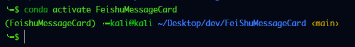

# FeiShuMessageCard
封装了飞书的消息卡片的一些方法，用于快速构建消息模板。


# 配置环境

## conda创建虚拟环境
```python
conda create -n FeishuMessageCard python=3.10
conda activate FeishuMessageCard
```


## 创建开发目录
```shell
mkdir FeishuCardMessage
cd FeishuCardMessage
```

## 拉取项目
```shell
git clone 'https://github.com/wr-rebirth/FeiShuMessageCard.git'
```

## 安装依赖
```shell
pip install -r requirements.txt
```

## 简单示例
```shell
from FeishuCardMessage import FeishuCardMessage
msg = FeishuCardMessage()
msg.add_markdown("hello")
msg.message_send(YOUR_WEBHOOK)
```


# 其他示例
```shell
from FeishuCardMessage import FeishuCardMessage
msg = FeishuCardMessage()
# 添加标题
msg.add_header("这是橙色标题", title_color="orange")
# 艾特所有人
msg.add_markdown("<at id=all></at>")
# 添加消息内容
msg.add_markdown("<text_tag color='violet'>这是彩色标签</text_tag>")
msg.add_markdown("<font color='red'>这是彩色字体</font>")
msg.add_markdown("[这是超链接](https://baidu.com)")
msg.add_markdown("这是分割线\n ---\n")
# 添加表格(表格只支持 pandas 的 dataframe 格式)
import pandas as pd
df = pd.read_csv('/tmp/temp.csv')
msg.add_dataframe_to_table(df)
# 发送
msg.message_send(YOUR_WEBHOOK)
```


## 配置个性化日志记录
- 修改 ansistrm.py 的 level_map 配置个性化颜色
- 引用附带的日志模块输出日志：
    ```python
    from lib.log import LOGGER as logger
    logger.info(INFO_MESSAGE)
    logger.debug(DEBUG_MESSAGE)
    ...
    ```