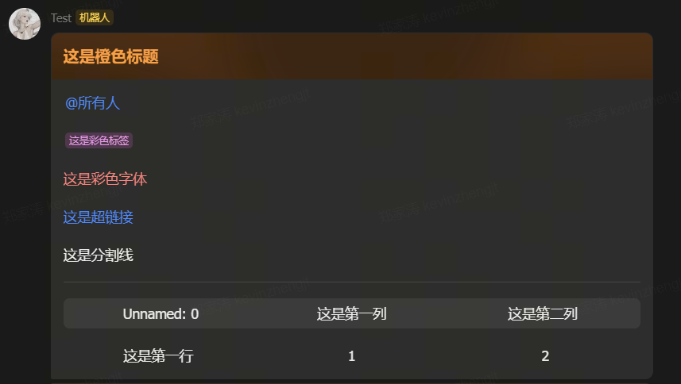

# FeiShuMessageCard
封装了飞书的消息卡片的一些方法，用于快速构建消息模板。


# 示例
```shell
from FeishuCardMessage import FeishuCardMessage
msg = FeishuCardMessage()
msg.add_header("这是橙色标题", title_color="orange")
# 艾特所有人
msg.add_markdown("<at id=all></at>")
msg.add_markdown("<text_tag color='violet'>这是彩色标签</text_tag>")
msg.add_markdown("<font color='red'>这是彩色字体</font>")
msg.add_markdown("[这是超链接](https://baidu.com)")
msg.add_markdown("这是分割线\n ---\n")
# 添加表格
import pandas as pd
df = pd.read_csv('/tmp/temp.csv')
msg.add_dataframe_to_table(df)
# 发送
msg.message_send(YOUR_WEBHOOK)
```

